# SDS-09 關鍵流程

本章以端到端時序說明主要功能的設計流程。所有 REST 請求皆帶 `csrfToken` 與 `packetTimestamp`，回應為 `{data:{error,reason,result}}`；為簡潔，後續圖中不重複標註。

## 1. 啟動與登入

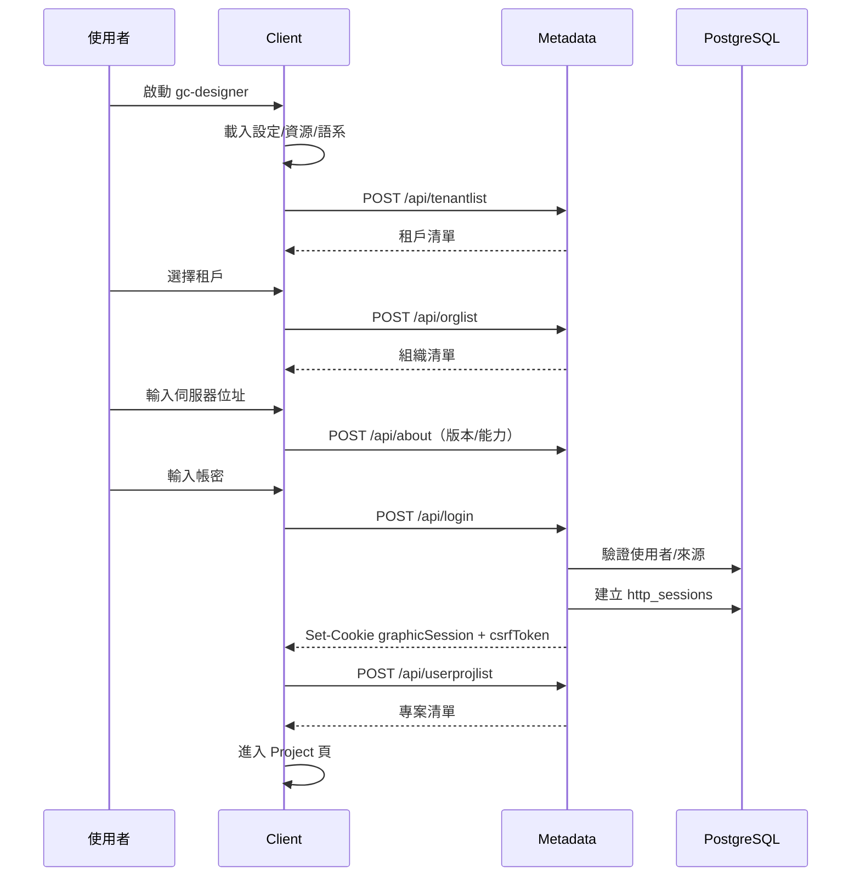
```mermaid
sequenceDiagram
    participant U as 使用者
    participant C as Client
    participant M as Metadata
    participant DB as PostgreSQL

    U->>C: 啟動 gc-designer
    C->>C: 載入設定/資源/語系
    C->>M: POST /api/tenantlist
    M-->>C: 租戶清單
    U->>C: 選擇租戶
    C->>M: POST /api/orglist
    M-->>C: 組織清單
    U->>C: 輸入伺服器位址
    C->>M: POST /api/about（版本/能力）
    U->>C: 輸入帳密
    C->>M: POST /api/login
    M->>DB: 驗證使用者/來源
    M->>DB: 建立 http_sessions
    M-->>C: Set-Cookie graphicSession + csrfToken
    C->>M: POST /api/userprojlist
    M-->>C: 專案清單
    C->>C: 進入 Project 頁
```

**失敗處理**

| 情境 | 行為 |
|------|------|
| 版本不符 | 提示更新 |
| 帳密錯誤 | 顯示錯誤、記錄稽核 |
| OPC UA 鎖定 | 顯示鎖定與解鎖方式 |
| 需改密 | 導向改密頁 |

## 2. 開啟專案與載入畫面

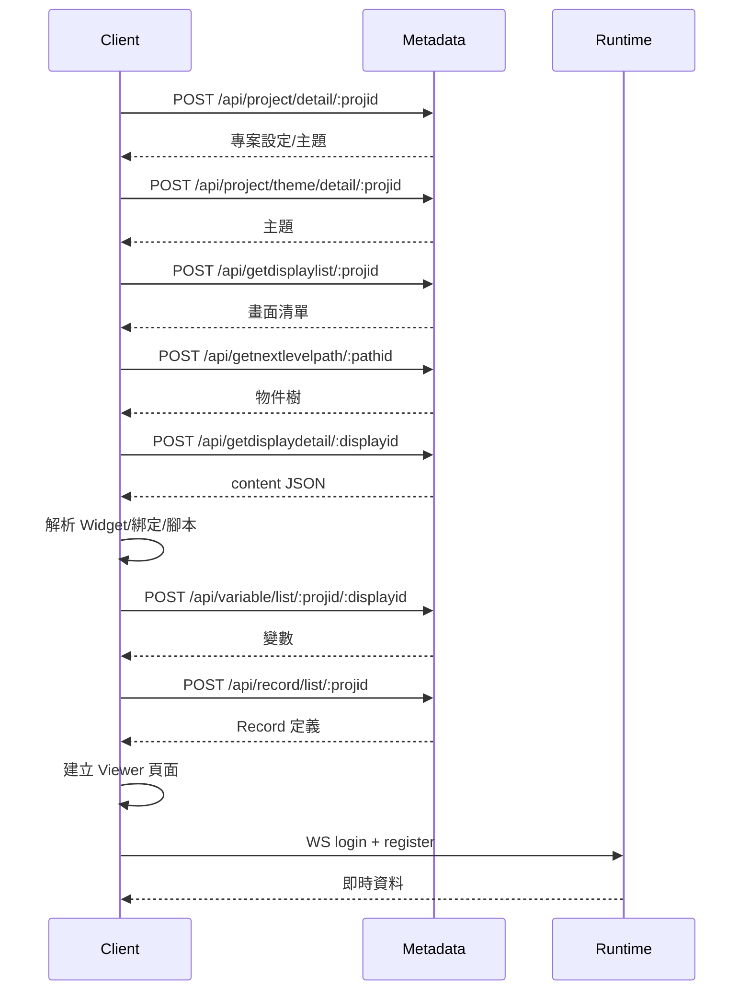
```mermaid
sequenceDiagram
    participant C as Client
    participant M as Metadata
    participant P as Runtime

    C->>M: POST /api/project/detail/:projid
    M-->>C: 專案設定/主題
    C->>M: POST /api/project/theme/detail/:projid
    M-->>C: 主題
    C->>M: POST /api/getdisplaylist/:projid
    M-->>C: 畫面清單
    C->>M: POST /api/getnextlevelpath/:pathid
    M-->>C: 物件樹
    C->>M: POST /api/getdisplaydetail/:displayid
    M-->>C: content JSON
    C->>C: 解析 Widget/綁定/腳本
    C->>M: POST /api/variable/list/:projid/:displayid
    M-->>C: 變數
    C->>M: POST /api/record/list/:projid
    M-->>C: Record 定義
    C->>C: 建立 Viewer 頁面
    C->>P: WS login + register
    P-->>C: 即時資料
```

## 3. 設計與儲存畫面

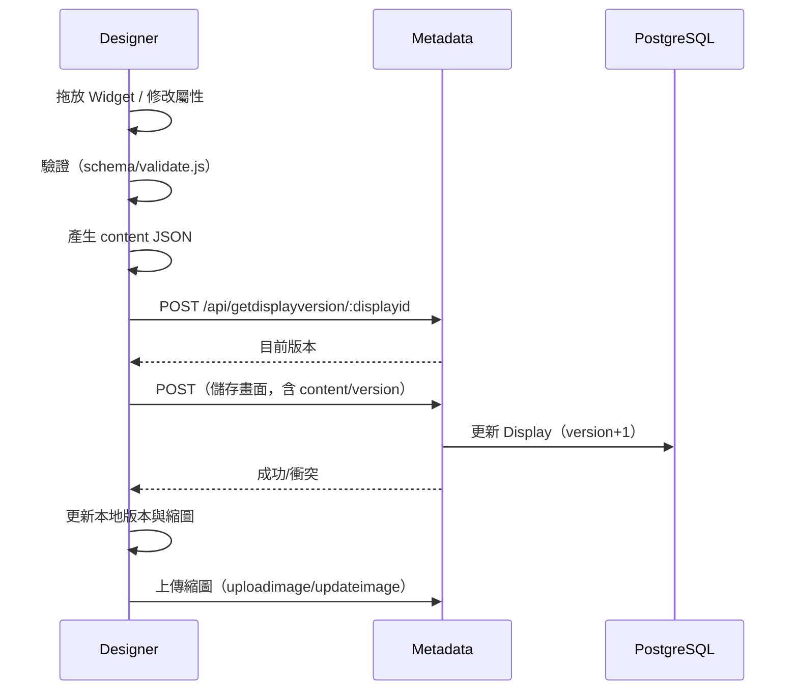
```mermaid
sequenceDiagram
    participant D as Designer
    participant M as Metadata
    participant DB as PostgreSQL

    D->>D: 拖放 Widget / 修改屬性
    D->>D: 驗證（schema/validate.js）
    D->>D: 產生 content JSON
    D->>M: POST /api/getdisplayversion/:displayid
    M-->>D: 目前版本
    D->>M: POST（儲存畫面，含 content/version）
    M->>DB: 更新 Display（version+1）
    M-->>D: 成功/衝突
    D->>D: 更新本地版本與縮圖
    D->>M: 上傳縮圖（uploadimage/updateimage）
```

**版本衝突**：若伺服器版本較新，提示覆蓋/另存；避免多人同時編輯覆蓋。

## 4. 切換 Designer → Viewer（預覽/執行）

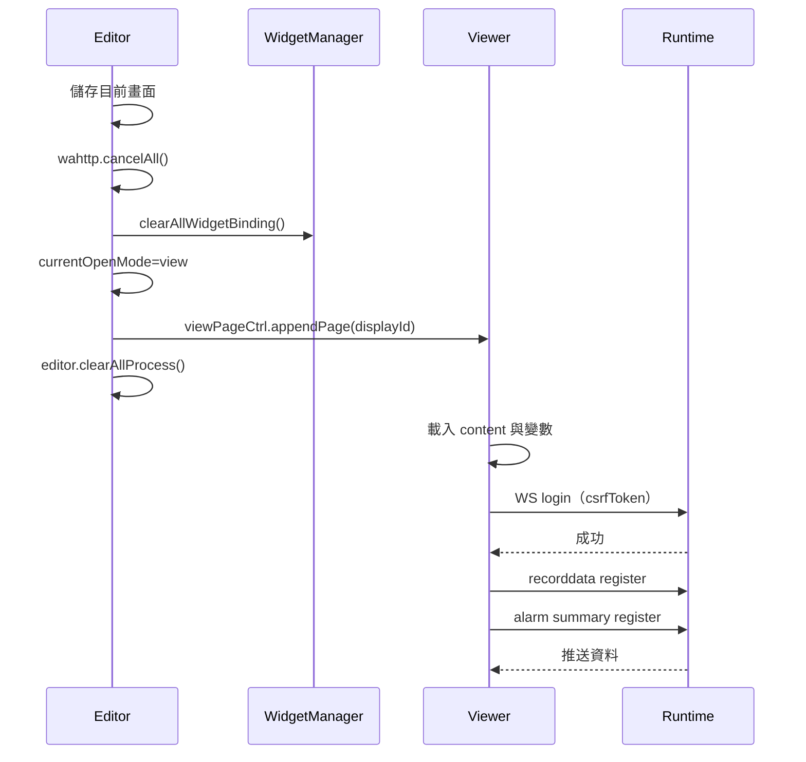
```mermaid
sequenceDiagram
    participant E as Editor
    participant W as WidgetManager
    participant V as Viewer
    participant P as Runtime

    E->>E: 儲存目前畫面
    E->>E: wahttp.cancelAll()
    E->>W: clearAllWidgetBinding()
    E->>E: currentOpenMode=view
    E->>V: viewPageCtrl.appendPage(displayId)
    E->>E: editor.clearAllProcess()
    V->>V: 載入 content 與變數
    V->>P: WS login（csrfToken）
    P-->>V: 成功
    V->>P: recorddata register
    V->>P: alarm summary register
    P-->>V: 推送資料
```

**返回設計**：停止訂閱、釋放腳本、恢復設計期綁定與計時器。

## 5. 即時資料（Record）

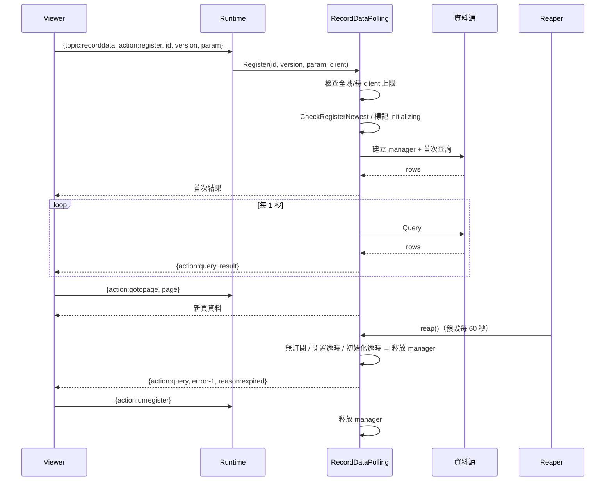
```mermaid
sequenceDiagram
    participant V as Viewer
    participant P as Runtime
    participant R as RecordDataPolling
    participant DB as 資料源
    participant T as Reaper

    V->>P: {topic:recorddata, action:register, id, version, param}
    P->>R: Register(id, version, param, client)
    R->>R: 檢查全域/每 client 上限
    R->>R: CheckRegisterNewest / 標記 initializing
    R->>DB: 建立 manager + 首次查詢
    DB-->>R: rows
    R-->>V: 首次結果
    loop 每 1 秒
        R->>DB: Query
        DB-->>R: rows
        R-->>V: {action:query, result}
    end
    V->>P: {action:gotopage, page}
    R-->>V: 新頁資料
    T->>R: reap()（預設每 60 秒）
    R->>R: 無訂閱 / 閒置逾時 / 初始化逾時 → 釋放 manager
    R-->>V: {action:query, error:-1, reason:expired}
    V->>P: {action:unregister}
    R->>R: 釋放 manager
```

**設計要點**

- 同一 `recordID` 多 Client 共用一個 `RecordRegister`。
- `version` 變更時重建。
- 最後一個 Client 取消或 TTL 到期後釋放。
- `register` 會刷新 `LastActivity`；被動看板需在 TTL 內重送 `register` 當 refresh，或將 `recorddata_idle_timeout_seconds` 設為 `0`。
- Reaper 會回收無訂閱、閒置逾時與初始化逾時的 record，並對在線 client 發送 `error=-1` expiry 訊息。
- 超過 `recorddata_max_registers` 或 `recorddata_max_subscriptions_per_client` 時，register 回傳錯誤。
- 寫入（`updatevalue`）需 Record 允許。

## 6. 歷史資料查詢

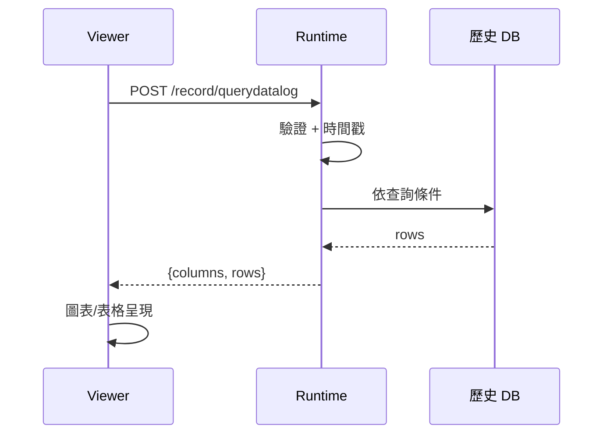
```mermaid
sequenceDiagram
    participant V as Viewer
    participant P as Runtime
    participant DB as 歷史 DB

    V->>P: POST /record/querydatalog
    P->>P: 驗證 + 時間戳
    P->>DB: 依查詢條件
    DB-->>P: rows
    P-->>V: {columns, rows}
    V->>V: 圖表/表格呈現
```

- 時間範圍、Tag、間隔由 Record/UI 決定。
- 大量資料以 `max_data_size` 截斷，前端分頁/縮放。

## 7. 告警摘要與推播

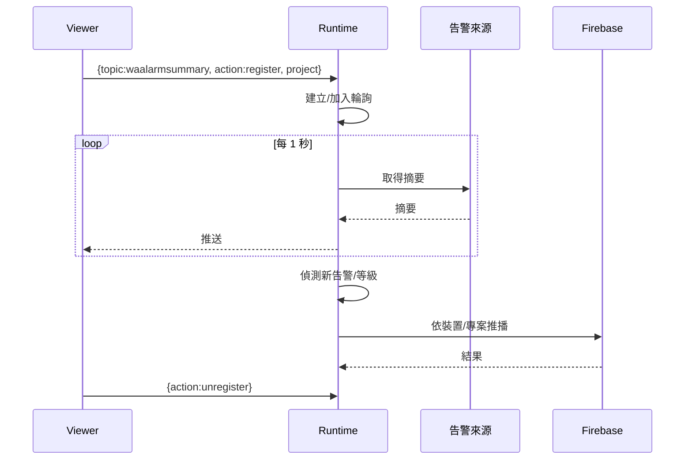
```mermaid
sequenceDiagram
    participant V as Viewer
    participant P as Runtime
    participant A as 告警來源
    participant F as Firebase

    V->>P: {topic:waalarmsummary, action:register, project}
    P->>P: 建立/加入輪詢
    loop 每 1 秒
        P->>A: 取得摘要
        A-->>P: 摘要
        P-->>V: 推送
    end
    P->>P: 偵測新告警/等級
    P->>F: 依裝置/專案推播
    F-->>P: 結果
    V->>P: {action:unregister}
```

**來源**：WA、EdgeHub、OPC UA、X（各自 topic 與輪詢）。

## 8. Record 建立與測試

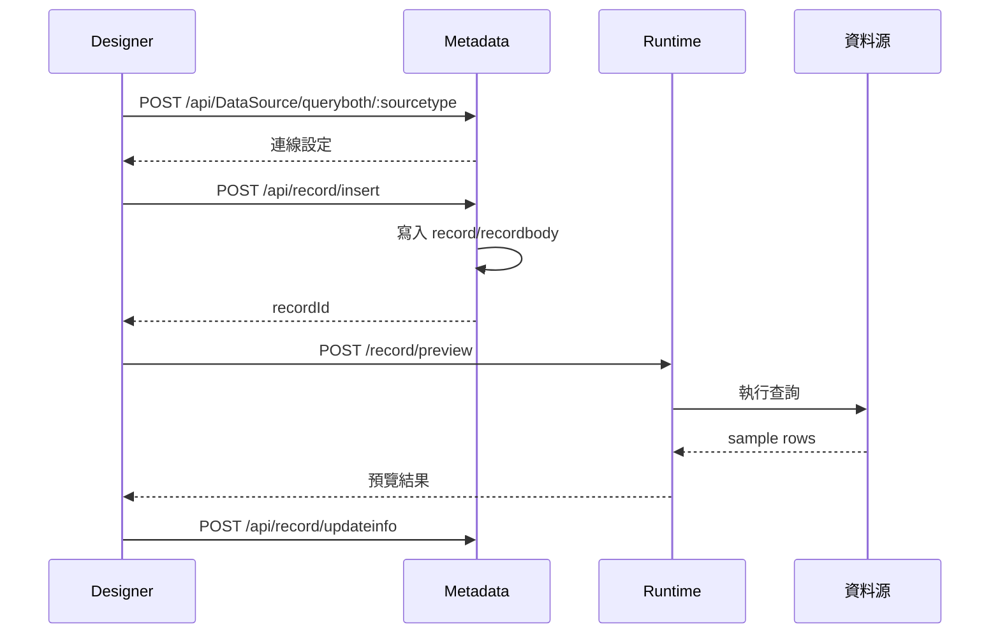
```mermaid
sequenceDiagram
    participant D as Designer
    participant M as Metadata
    participant P as Runtime
    participant DB as 資料源

    D->>M: POST /api/DataSource/queryboth/:sourcetype
    M-->>D: 連線設定
    D->>M: POST /api/record/insert
    M->>M: 寫入 record/recordbody
    M-->>D: recordId
    D->>P: POST /record/preview
    P->>DB: 執行查詢
    DB-->>P: sample rows
    P-->>D: 預覽結果
    D->>M: POST /api/record/updateinfo
```

- 預覽失敗顯示資料源錯誤（連線/語法/權限）。
- 儲存前可調整欄位、分頁、更新間隔。

## 9. 匯入/匯出

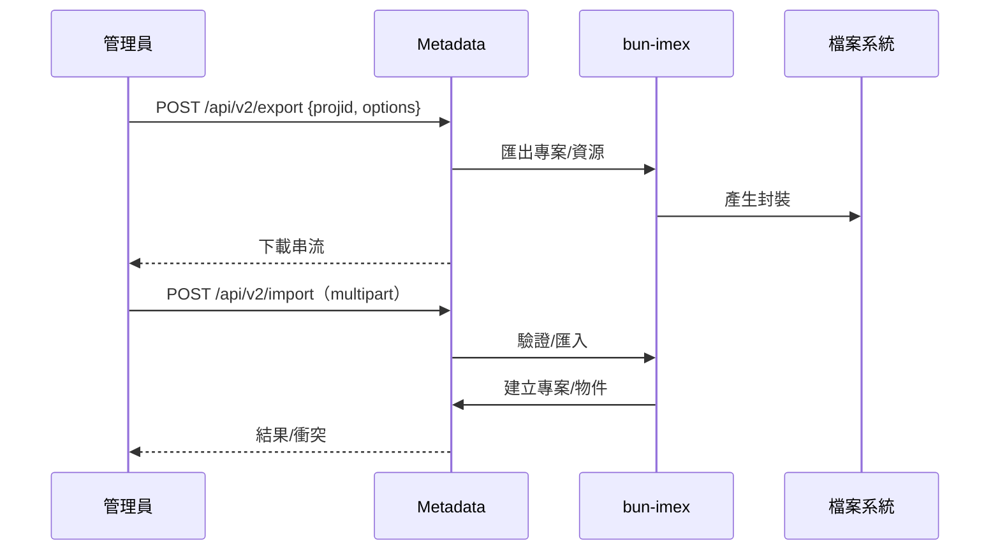
```mermaid
sequenceDiagram
    participant A as 管理員
    participant M as Metadata
    participant B as bun-imex
    participant FS as 檔案系統

    A->>M: POST /api/v2/export {projid, options}
    M->>B: 匯出專案/資源
    B->>FS: 產生封裝
    M-->>A: 下載串流
    A->>M: POST /api/v2/import（multipart）
    M->>B: 驗證/匯入
    B->>M: 建立專案/物件
    M-->>A: 結果/衝突
```

- v1/v2 格式並存。
- 匯入需處理同名、版本、資源參照。
- 全程記錄稽核。

## 10. 使用者與權限管理

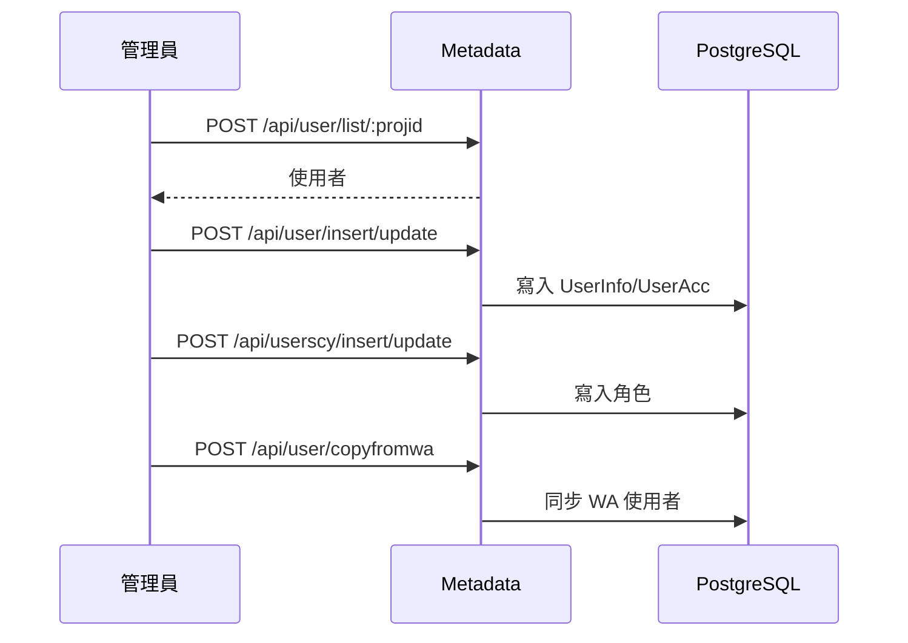
```mermaid
sequenceDiagram
    participant A as 管理員
    participant M as Metadata
    participant DB as PostgreSQL

    A->>M: POST /api/user/list/:projid
    M-->>A: 使用者
    A->>M: POST /api/user/insert/update
    M->>DB: 寫入 UserInfo/UserAcc
    A->>M: POST /api/userscy/insert/update
    M->>DB: 寫入角色
    A->>M: POST /api/user/copyfromwa
    M->>DB: 同步 WA 使用者
```

- 修改立即生效（新請求）。
- 既有 Session 不自動失效（必要時可加版本欄位）。

## 11. OPC UA 子系統

### 11.1 設定 UI 設定專案/連線/Tag

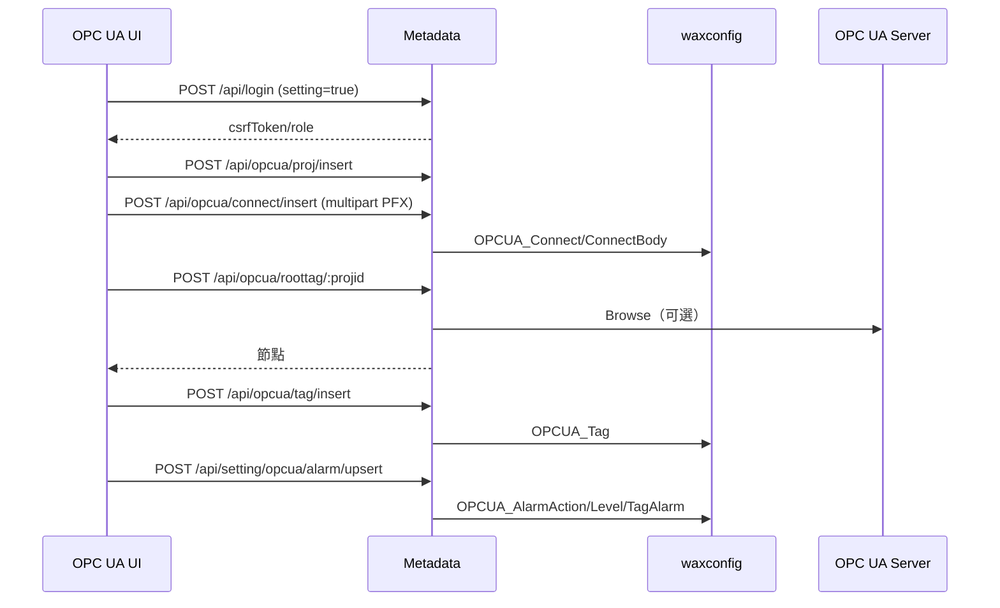
```mermaid
sequenceDiagram
    participant U as OPC UA UI
    participant M as Metadata
    participant DB as waxconfig
    participant O as OPC UA Server
    U->>M: POST /api/login (setting=true)
    M-->>U: csrfToken/role
    U->>M: POST /api/opcua/proj/insert
    U->>M: POST /api/opcua/connect/insert (multipart PFX)
    M->>DB: OPCUA_Connect/ConnectBody
    U->>M: POST /api/opcua/roottag/:projid
    M->>O: Browse（可選）
    M-->>U: 節點
    U->>M: POST /api/opcua/tag/insert
    M->>DB: OPCUA_Tag
    U->>M: POST /api/setting/opcua/alarm/upsert
    M->>DB: OPCUA_AlarmAction/Level/TagAlarm
```

- 憑證可由 UI 上傳或 `/Certificate/create` 產生。
- Tag 匯入/分頁由 `TagPage`；權限由 `OPCUA_User*` 管理。

### 11.2 Viewer 直連即時值

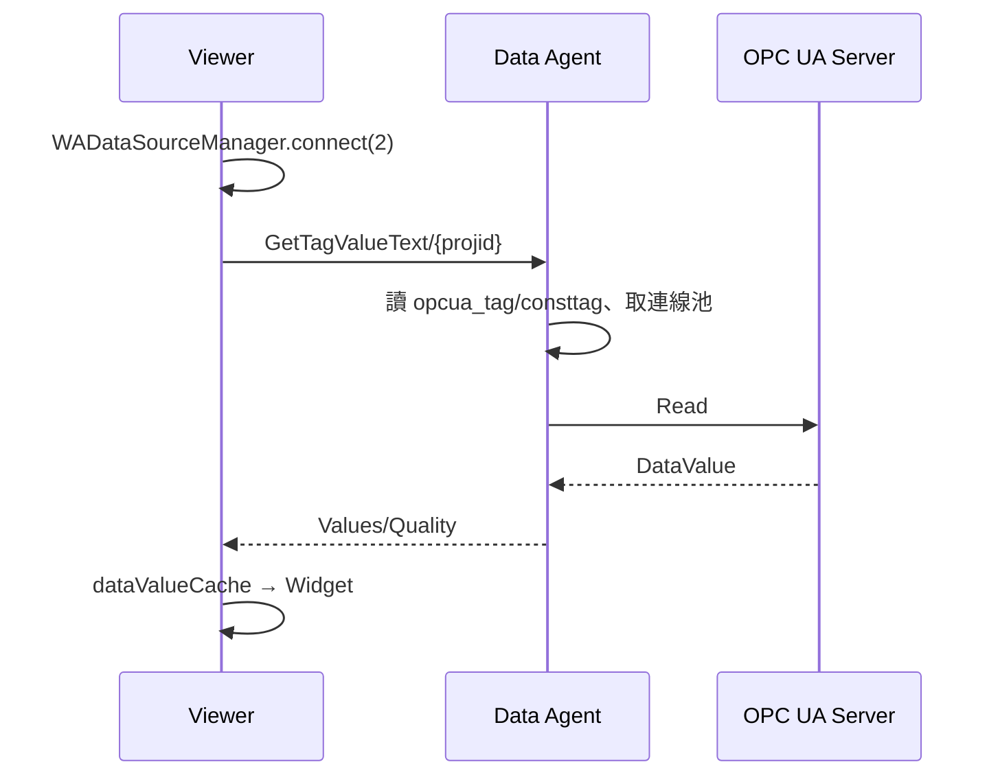
```mermaid
sequenceDiagram
    participant V as Viewer
    participant D as Data Agent
    participant O as OPC UA Server
    V->>V: WADataSourceManager.connect(2)
    V->>D: GetTagValueText/{projid}
    D->>D: 讀 opcua_tag/consttag、取連線池
    D->>O: Read
    O-->>D: DataValue
    D-->>V: Values/Quality
    V->>V: dataValueCache → Widget
```

### 11.3 Viewer 直連歷史值

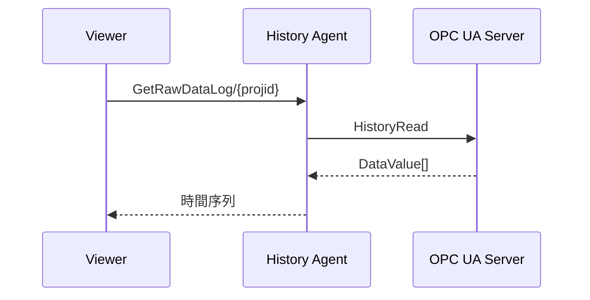
```mermaid
sequenceDiagram
    participant V as Viewer
    participant H as History Agent
    participant O as OPC UA Server
    V->>H: GetRawDataLog/{projid}
    H->>O: HistoryRead
    O-->>H: DataValue[]
    H-->>V: 時間序列
```

### 11.4 Alarm 生命週期

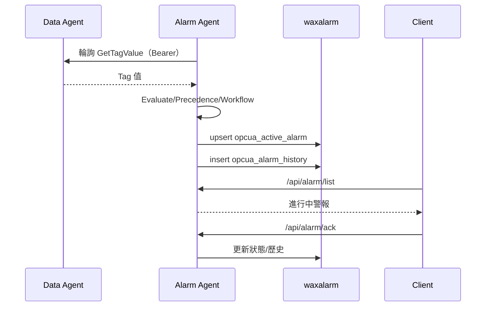
```mermaid
sequenceDiagram
    participant D as Data Agent
    participant A as Alarm Agent
    participant DB as waxalarm
    participant C as Client
    A->>D: 輪詢 GetTagValue（Bearer）
    D-->>A: Tag 值
    A->>A: Evaluate/Precedence/Workflow
    A->>DB: upsert opcua_active_alarm
    A->>DB: insert opcua_alarm_history
    C->>A: /api/alarm/list
    A-->>C: 進行中警報
    C->>A: /api/alarm/ack
    A->>DB: 更新狀態/歷史
```

- 重啟時 `Engine.Recover()` 載入未關閉警報並在首次 poll 對帳。
- `opcua_alarmaction` 決定 Ack/Process/Summary/Log 門檻。

## 12. 3D 場景與資產

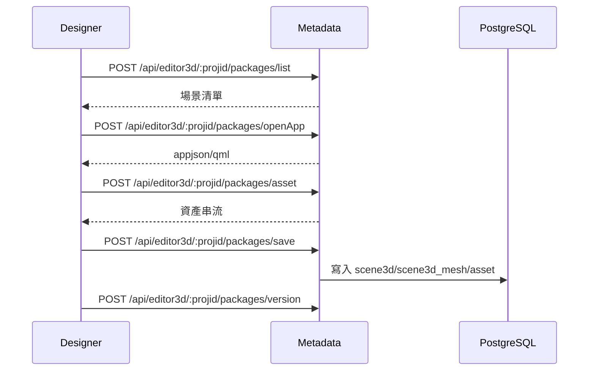
```mermaid
sequenceDiagram
    participant D as Designer
    participant M as Metadata
    participant DB as PostgreSQL

    D->>M: POST /api/editor3d/:projid/packages/list
    M-->>D: 場景清單
    D->>M: POST /api/editor3d/:projid/packages/openApp
    M-->>D: appjson/qml
    D->>M: POST /api/editor3d/:projid/packages/asset
    M-->>D: 資產串流
    D->>M: POST /api/editor3d/:projid/packages/save
    M->>DB: 寫入 scene3d/scene3d_mesh/asset
    D->>M: POST /api/editor3d/:projid/packages/version
```

- 大型檔案以串流/版本處理。
- 資產以 `rel_dir` + `logical_name` 唯一。

## 13. 系統資訊與通訊狀態

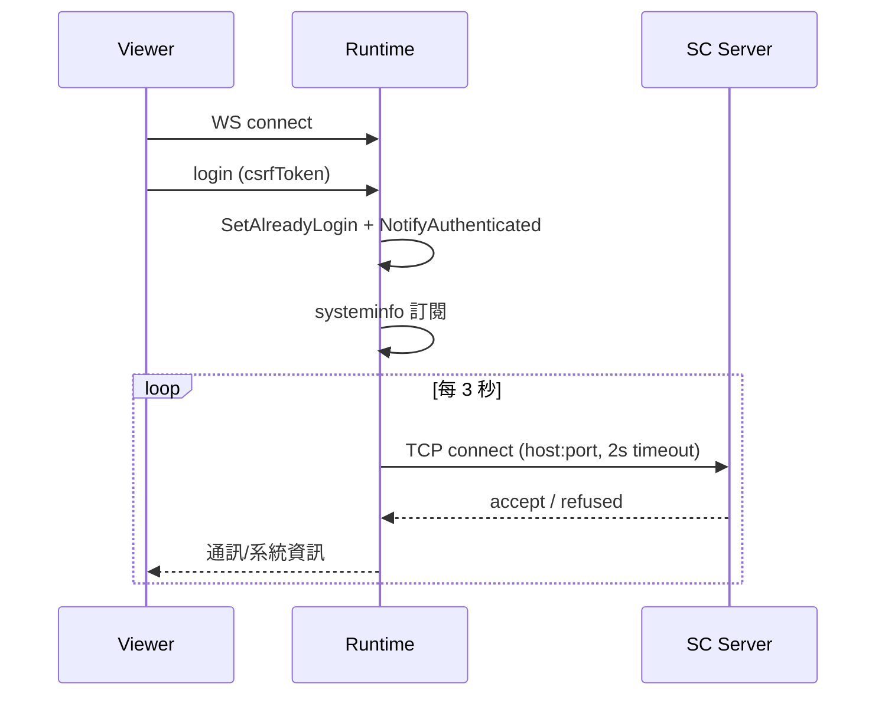
```mermaid
sequenceDiagram
    participant V as Viewer
    participant P as Runtime
    participant S as SC Server
    V->>P: WS connect
    V->>P: login (csrfToken)
    P->>P: SetAlreadyLogin + NotifyAuthenticated
    P->>P: systeminfo 訂閱
    loop 每 3 秒
        P->>S: TCP connect (host:port, 2s timeout)
        S-->>P: accept / refused
        P-->>V: 通訊/系統資訊
    end
```

- 未登入不建立 systeminfo 訂閱。
- TCP 連線成功只代表 port 可達，不代表 API 健康。
- 用於 Viewer 通訊狀態與診斷對話框。

## 14. 錯誤與離線處理

| 情境 | Client 行為 | Server 行為 |
|------|-------------|-------------|
| `-100` | 清除 Session、導回登入 | 清 Cookie、記錄 |
| `-102` | 校正時間提示 | 拒絕 |
| 網路中斷 | 重試/退避、顯示離線 | — |
| WS 斷線 | 自動重連並重新登入/訂閱 | Hub 清理 |
| 外部資料源失敗 | 顯示錯誤、保留其他功能 | 回 `-501` |
| 版本衝突 | 提示覆蓋/另存 | 回衝突 |

## 15. 關閉與重啟

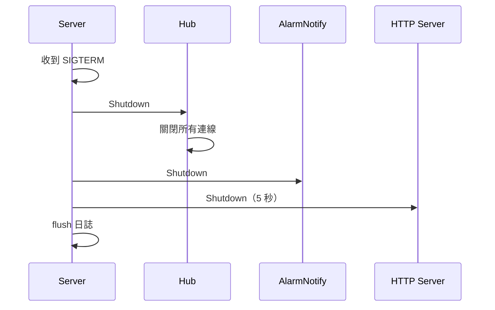
```mermaid
sequenceDiagram
    participant S as Server
    participant H as Hub
    participant A as AlarmNotify
    participant HTTP as HTTP Server

    S->>S: 收到 SIGTERM
    S->>H: Shutdown
    H->>H: 關閉所有連線
    S->>A: Shutdown
    S->>HTTP: Shutdown（5 秒）
    S->>S: flush 日誌
```

- Client 偵測斷線後重連。
- 部署時採滾動更新，需 Sticky Session 或共用 Session DB。

## 16. 需求對照

| 流程 | 需求 |
|------|------|
| 登入/專案 | FR-CLI-001~020、FR-META-001~012 |
| 設計/儲存 | FR-CLI-021~045、FR-META-013~020 |
| 即時/歷史 | FR-RT-001~017 |
| 告警/推播 | FR-RT-010~017、FR-RT-018~020 |
| 匯入/匯出 | FR-META-036~045 |
| 使用者/OPC UA | FR-META-029~035、FR-OPC-001~012 |
| OPC UA 直連 | FR-OPC-015、FR-OPC-018、IF-OPC-002/003 |
| OPC UA Alarm | FR-OPC-028~045、IF-OPC-004 |
| 3D | FR-CLI-056~060 |
| 關閉/部署 | FR-RT-024~025、NFR-REL-003~004 |
